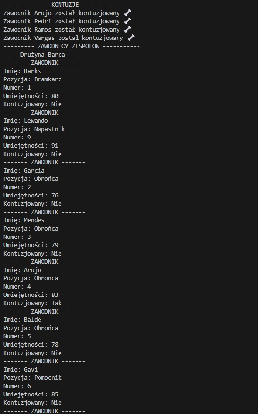
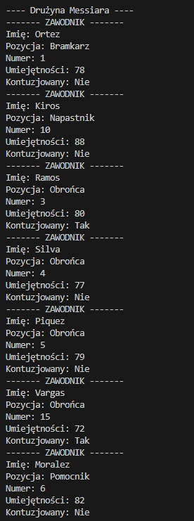
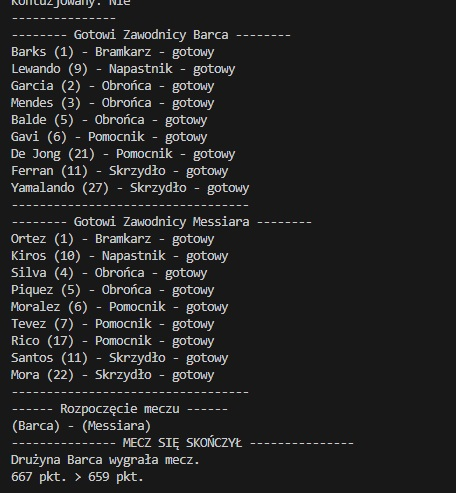

# ⚽ Klub Piłkarski - Symulator Zarządzania Drużyną

## 📖 O Aplikacji

**Klub Piłkarski** to prosta gra symulacyjna napisana w Pythonie, która pozwala zarządzać drużyną piłkarską i rozgrywać mecze. Program symuluje realistyczne aspekty piłki nożnej, takie jak kontuzje zawodników, zmęczenie i różne umiejętności graczy.

## 🎮 Jak to działa?

### 1. Tworzenie Zawodników

W grze mamy trzy typy zawodników:

- **Pilkarz** - podstawowy zawodnik z umiejętnościami
- **Bramkarz** - ma dodatkową statystykę "refleks"
- **Napastnik** - ma dodatkową statystykę "wykończenie"

Każdy zawodnik posiada:

- **Imię** - identyfikuje gracza
- **Pozycja** - np. Bramkarz, Obrońca, Pomocnik, Napastnik, Skrzydło
- **Numer** - numer na koszulce
- **Umiejętność** - poziom gry (0-100)
- **Zmęczenie** - jak bardzo jest zmęczony (0-100)
- **Status kontuzji** - czy może grać

### 2. System Kontuzji

Przed każdym meczem losowo sprawdzane są kontuzje. Im wyższa umiejętność zawodnika, tym mniejsza szansa na kontuzję! To oznacza, że lepsi gracze są bardziej odporni na urazy.

<div align="center">
  
  <p><em>Ekran 1: System kontuzji - niektórzy zawodnicy zostali kontuzjowani, a następnie wyświetlana jest lista zawodników drużyny Barca z ich statystykami</em></p>
</div>

### 3. Drużyny

W grze stworzone są dwie drużyny:

- **Barca** - z gwiazdami takimi jak Lewando i Yamalando
- **Messiara** - z zawodnikami jak Kiros i Santos

Każda drużyna ma pełny skład 11 graczy.

<div align="center">
  
  <p><em>Ekran 2: Pełna lista zawodników drużyny Messiara ze wszystkimi statystykami</em></p>
</div>

### 4. Gotowość do Meczu

Nie każdy zawodnik może grać! Aby być gotowym do meczu, zawodnik musi spełniać dwa warunki:

- **Nie być kontuzjowanym** 🏥
- **Mieć zmęczenie poniżej 70** 💪

Program automatycznie wybiera tylko tych zawodników, którzy są w dobrej kondycji.

<div align="center">
  
  <p><em>Ekran 3: Lista zawodników gotowych do gry z obu drużyn oraz wynik rozgrywanego meczu</em></p>
</div>

### 5. Rozgrywka Meczu

Mecz jest rozgrywany automatycznie! Wynik zależy od:

- **Umiejętności** zawodników (+ punkty)
- **Zmęczenia** zawodników (- punkty)
- Kontuzjowani gracze w ogóle nie biorą udziału

Program sumuje wszystkie punkty każdej drużyny i ogłasza zwycięzcę!

## 🔧 Struktura Folderów

```
/KlubPilkarski/
│
├── main.py          # Główny kod programu
├── opis.md          # Ten plik z opisem
├── screen1.jpg      # Screenshot: Kontuzje + Barca
├── screen2.jpg      # Screenshot: Drużyna Messiara
└── screen3.jpg      # Screenshot: Gotowi zawodnicy + mecz
```

## 🚀 Jak uruchomić?

1. Upewnij się, że masz zainstalowany Python (wersja 3.6 lub nowsza)
2. Otwórz terminal/wiersz poleceń
3. Przejdź do folderu z grą:
   ```bash
   cd KlubPilkarski
   ```
4. Uruchom program:
   ```bash
   python main.py
   ```

## 📊 Przykładowy Przebieg Gry

1. **Start** - Tworzenie drużyn z zawodnikami
2. **Losowanie kontuzji** - Część graczy może zostać kontuzjowana
3. **Wyświetlenie składów** - Wszystkie informacje o zawodnikach
4. **Lista gotowych** - Kto może grać w meczu
5. **Mecz** - Automatyczne rozegranie i ogłoszenie wyniku!

## 🎯 Kluczowe Koncepcje Programowania

Jeśli uczysz się Pythona, w tym kodzie zobaczysz:

- **Klasy (OOP)** - `Pilkarz`, `Bramkarz`, `Napastnik`, `Druzyna`, `Mecz`
- **Dziedziczenie** - `Bramkarz` i `Napastnik` dziedziczą po `Pilkarz`
- **Listy** - przechowywanie zawodników
- **Pętle** - `for` do przetwarzania wielu zawodników
- **Warunki** - `if/elif/else` do sprawdzania kontuzji i zmęczenia
- **Funkcje/Metody** - organizacja kodu w logiczne bloki
- **Losowość** - `random` do symulacji kontuzji

## 💡 Możliwe Rozszerzenia

Chcesz rozbudować grę? Możesz dodać:

- System treningów zwiększających umiejętności
- Transfery zawodników między drużynami
- Ligę z wieloma meczami i tabelą
- System finansów klubu
- Strategie meczowe (defensywna/ofensywna)
- Zapisywanie wyników do pliku

## 👨‍💻 Dla Początkujących

Nie martw się, jeśli kod wydaje się skomplikowany! Zacznij od:

1. Przeczytania komentarzy w kodzie
2. Uruchomienia programu i obserwacji wyniku
3. Zmiany wartości umiejętności zawodników
4. Dodania swojego zawodnika do listy
5. Stopniowego eksperymentowania z kodem

**Pamiętaj:** Każdy programista zaczynał od podstaw. Im więcej eksperymentujesz, tym więcej się uczysz! ⚽🎉

---

_Powodzenia w zarządzaniu swoją drużyną!_ 🏆
